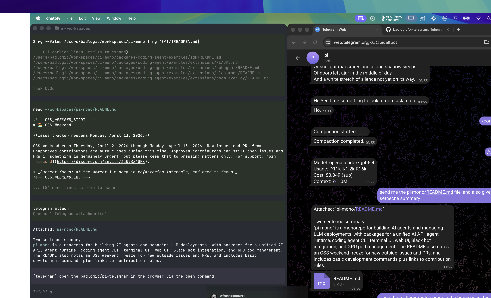

# pi-telegram



> Full pi build session: [View the session transcript](https://pi.dev/session/#14acfe07b7844c8abec55ed9fbddc17f), which captures the full pi session in which `pi-telegram` was built.

Telegram DM bridge for pi.

## Install

From git:

```bash
pi install git:github.com/badlogic/pi-telegram
```

Or for a single run:

```bash
pi -e git:github.com/badlogic/pi-telegram
```

## Configure

### Telegram

1. Open [@BotFather](https://t.me/BotFather)
2. Run `/newbot`
3. Pick a name and username
4. Copy the bot token

Optional: run `/setcommands` in BotFather and paste this block so Telegram autocompletes bridge commands:

```text
start - Show help and pairing instructions
help - Show available commands
sessions - List active pi sessions
use - Select a pi session in selector mode
status - Show selected session status
model - Show or change the selected session model
compact - Compact the selected session context
follow - Queue a follow-up for after the active run
steer - Steer the active run with an urgent correction
stop - Stop the active run
disconnect - Disconnect the selected pi session
broker - Show Telegram broker status
topicsetup - Use this group for per-session topics
```

### pi

Start pi, then run:

```bash
/telegram-setup
```

Paste the bot token when prompted.

The extension stores config in:

```text
~/.pi/agent/telegram.json
```

## Connect pi sessions

Run this in each pi session you want reachable from Telegram:

```bash
/telegram-connect
```

One connected session becomes the broker that polls Telegram; other sessions register with it and get their own route/topic. Use `/sessions` and `/use` from Telegram to inspect and select sessions when selector routing is active.

To disconnect the current session and remove its route/topic:

```bash
/telegram-disconnect
```

Check status:

```bash
/telegram-status
```

## Pair your Telegram account

After token setup and `/telegram-connect`:

1. Open the DM with your bot in Telegram
2. Send the 4-digit PIN shown by pi within 5 minutes

The user who sends the valid current PIN becomes the allowed Telegram user for the bridge. `/start <PIN>` also works for Telegram deep-link or fallback clients, but the PIN expires and repeated failed attempts require rerunning setup.

## Usage

Chat with your bot in Telegram DMs.

### Send text

Send any message in the bot DM. It is forwarded into pi with a `[telegram]` prefix.

### Send images and files

Send images, albums, or files in the DM.

The extension:
- downloads them to `~/.pi/agent/tmp/telegram/<session-id>`
- keeps those files private and cleans them up after the session lifecycle no longer needs them
- includes local file paths in the prompt
- forwards inbound images as image inputs to pi

### Ask for files back

If you ask pi for a file or generated artifact, pi should call the `telegram_attach` tool. The extension then sends those files with the next Telegram reply.

Examples:
- `summarize this image`
- `read this README and summarize it`
- `write me a markdown file with the plan and send it back`
- `generate a shell script and attach it`

### Stop a run

In Telegram, send:

```text
stop
```

or:

```text
/stop
```

That aborts the active pi turn.

### Steer and queue follow-ups

If you send a normal Telegram message while pi is busy, it is queued as follow-up work by default.
Telegram shows `Steer now` and `Cancel` buttons for eligible queued follow-ups so you can convert one into active-turn steering or withdraw it before it starts. The bridge removes those buttons when the follow-up starts, is handled, or is no longer waiting.

You can also be explicit:

```text
/follow run all tests
/steer use this correction now
```

## Activity and final replies

While pi is working, the extension sends activity updates so Telegram can show progress.
Assistant response text is sent once, as the final reply, when the turn completes.

Final replies are sent as normal Telegram messages and long replies are split below Telegram's message-size limit.

## Notes

- Multiple pi sessions can connect to the same bot; one acts as broker while the others register as clients
- Replies are sent as normal Telegram messages, not quote-replies
- Long replies are split below Telegram's 4096 character limit
- Outbound files are sent via `telegram_attach`

## License

MIT
